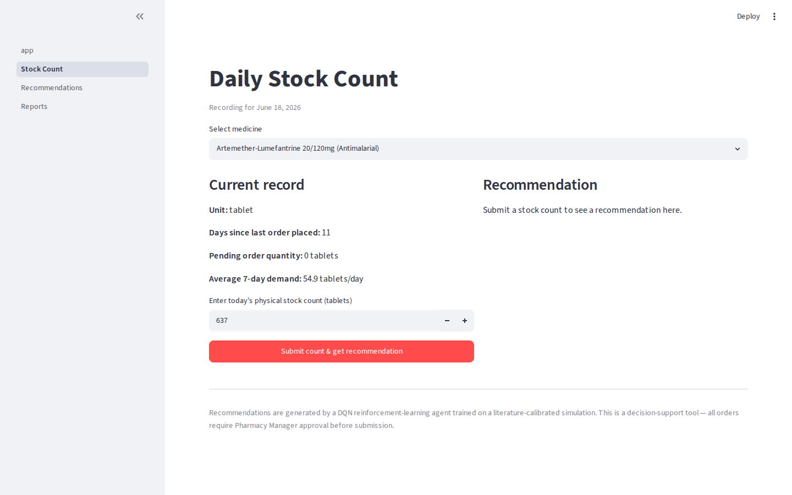
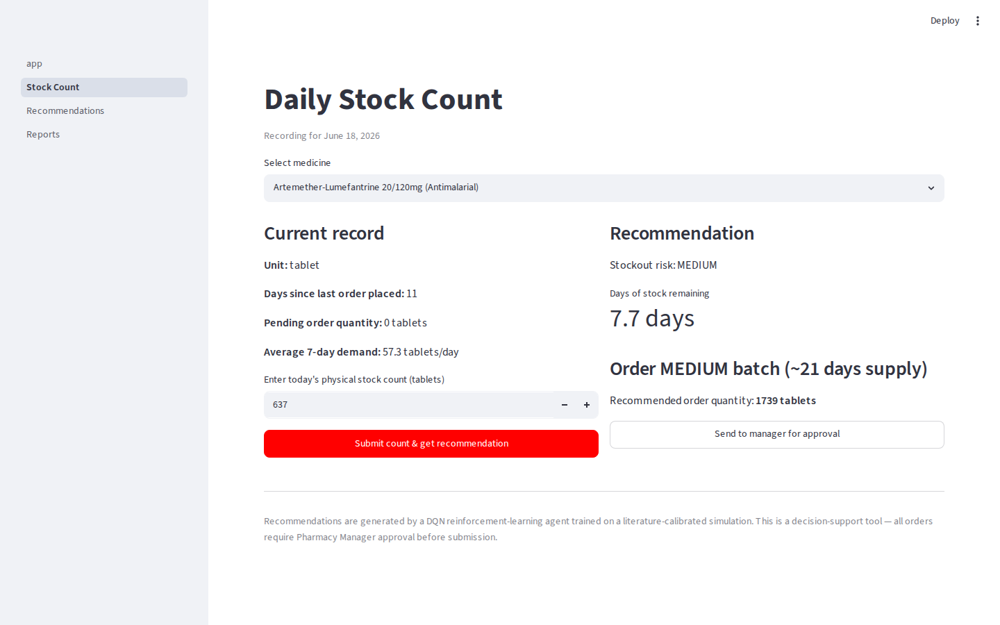
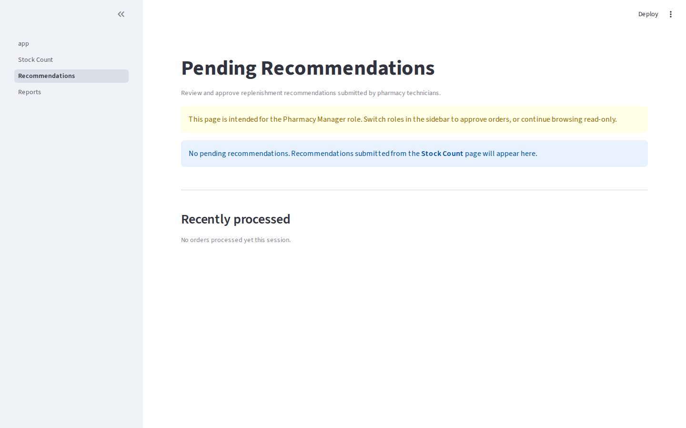
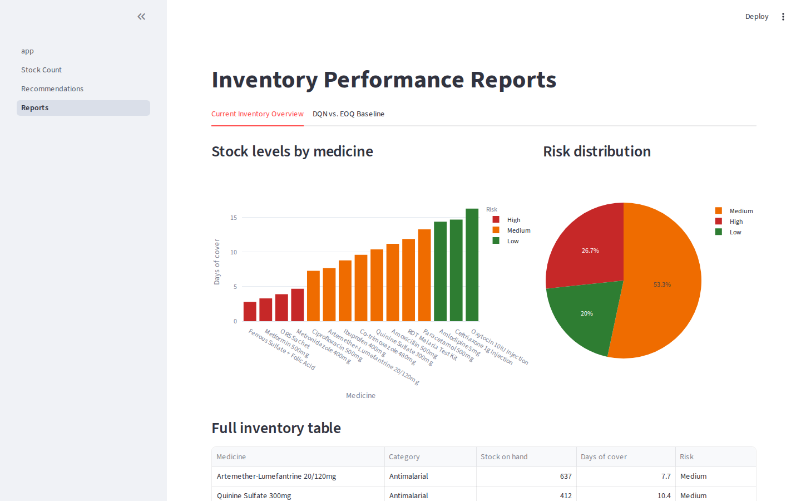
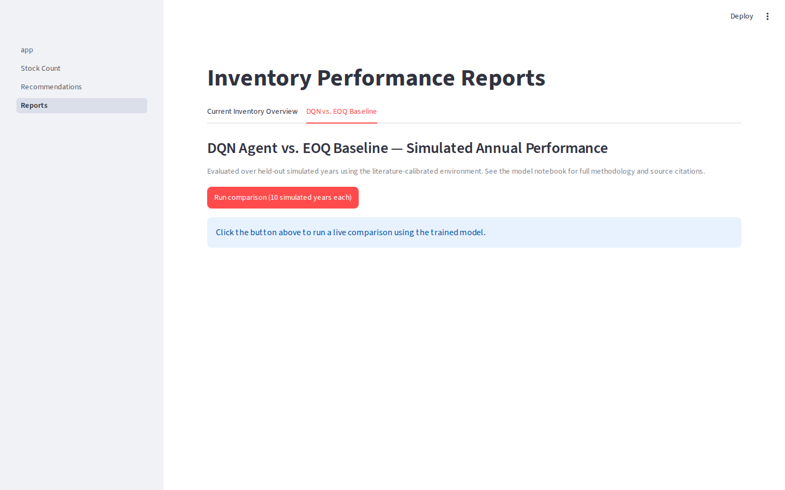

# Rebex: A Reinforcement Learning Approach to Essential Medicine Stockout Prevention in Eritrean District Hospital Pharmacies
 
## Table of Contents
 
1. [Project Description](#project-description)
2. [System Architecture](#system-architecture)
3. [Features](#features)
4. [Tech Stack](#tech-stack)
5. [How to Install and Run](#how-to-install-and-run)
6. [How to Use](#how-to-use)
7. [Project Structure](#project-structure)
8. [Methodology](#methodology)
9. [Performance Metrics](#performance-metrics)
10. [Challenges & Future Work](#challenges--future-work)
---
 
## Project Description
 
**Rebex** is an intelligent pharmaceutical inventory management system that uses **Deep Q-Network (DQN) Reinforcement Learning** to prevent essential medicine stockouts in Eritrean district hospital pharmacies.
 
District hospital pharmacies in Eritrea are the primary point of medicine access for large portions of the population, yet essential medicine availability sits at around 80% — meaning roughly 1 in 5 prescribed medicines is unavailable at the point of care. Traditional inventory control methods such as Economic Order Quantity (EOQ) and manual periodic reviews cannot adapt to the unpredictable demand patterns, seasonal disease surges, and supply chain disruptions common in low-resource healthcare environments.
---
 
## System Architecture
 
```
┌─────────────────────────────────┐
│        Streamlit Dashboard       │
│  (Inventory monitoring, alerts,  │
│   replenishment recommendations) │
└────────────────┬────────────────┘
                 │
┌────────────────▼────────────────┐
│         FastAPI Backend          │
│  (DQN agent, HMM demand model,  │
│   /api/recommend endpoint)       │
└────────────────┬────────────────┘
                 │
┌────────────────▼────────────────┐
│         Database                │
│  (Medicines, stock records,     │
│   orders, recommendations)      │
└─────────────────────────────────┘
```
 
---
 
## Features
 
- **Daily stock count recording** — pharmacy technicians log current inventory levels
- **RL-powered replenishment recommendations** — DQN agent recommends order quantities per medicine based on current state
- **Demand regime detection** — HMM identifies latent demand states (stable, surge, disruption) to provide context-aware recommendations
- **Stockout risk dashboard** — visual alerts for medicines approaching critical stock levels
- **Order approval workflow** — pharmacy manager reviews and approves recommendations before submission
- **Inventory performance reports** — historical stockout frequency, service level, and holding cost trends
- **EOQ baseline comparison** — side-by-side metrics comparing RL agent vs. traditional EOQ policy
---
 
## Tech Stack
 
| Layer | Technology |
|---|---|
| Dashboard / UI | Streamlit |
| Backend / API | FastAPI |
| RL Framework | Stable-Baselines3 (DQN), PyTorch |
| Demand Modeling | hmmlearn (HMM) |
| RL Environment | Custom OpenAI Gym-compatible env |
| Database | PostgreSQL |
| ORM | SQLAlchemy |
| Containerization | Docker + Docker Compose |
| Data & Viz | Pandas, NumPy, Matplotlib, Seaborn |
| Language | Python 3.10+ |
 
---
 
## How to Install and Run
 
### Prerequisites
 
- [Docker](https://www.docker.com/get-started) and Docker Compose installed
- Git installed
- Python 3.10+
### 1. Clone the repository
 
```bash
git clone https://github.com/rodwol/rl_pharmaceutical_optimization.git
cd rl_pharmaceutical_optimization
```
 
### 2. Build and run with Docker Compose
 
```bash
docker-compose up --build
```
 
This will spin up three services:
- `db` — PostgreSQL database on port 
- `api` — FastAPI backend on port 
- `dashboard` — Streamlit UI on port 
### 3. Access the application
 
| Service | URL |
|---|---|
| Streamlit Dashboard | http://|
| FastAPI Docs (Swagger) | http:// |
| Database |  |
 
### 4. Running outside Docker (development mode)
 
```bash
# Install dependencies
pip install -r requirements.txt
 
# Start the database (Docker only for DB is fine)
docker-compose up db
 
# Run the API
uvicorn app.main:app --reload --port 8000
 
# Run the dashboard
streamlit run dashboard/app.py
```
 
### 5. Train the RL agent
 
```bash
python rl/train.py --episodes 1000 --save-path models/dqn_agent.pt
```
 
---

### Design - Screenshots of the app interfaces

 
### DQN recommendation



 
### Reports — risk overview (DQN vs. EOQ)


 
## How to Use
 
### Pharmacy Technician
 
1. Log in with your assigned credentials.
2. Navigate to **Daily Stock Count** and enter current quantity on hand for each medicine.
3. Click **Get Recommendation** — the RL agent will generate an order suggestion.
4. Submit the count. The recommendation is forwarded to the Pharmacy Manager for approval.
### Pharmacy Manager
 
1. Navigate to **Pending Recommendations**.
2. Review the recommended order quantities alongside current stock levels and stockout risk scores.
3. Approve or adjust quantities and submit the order to the district medical store.
4. View historical performance on the **Reports** tab.
### Default credentials (development only)
 
| Role | Username | Password |
|---|---|---|
| Technician | `tech_demo` | `demo1234` |
| Manager | `manager_demo` | `demo1234` |
 
> Change all credentials before any real-world deployment.
 
---
 
## Project Structure
 
```
rxguard-rl-pharmacy/
├── api/                    # FastAPI backend
│   ├── main.py
│   ├── routes/
│   │   ├── recommend.py    # /api/recommend endpoint
│   │   └── orders.py
│   └── models/             # SQLAlchemy ORM models
├── dashboard/              # Streamlit frontend
│   ├── app.py
│   └── pages/
│       ├── stock_count.py
│       ├── recommendations.py
│       └── reports.py
├── rl/                     # Reinforcement learning core
│   ├── environment.py      # Custom Gym environment
│   ├── agent.py            # DQN agent
│   ├── train.py            # Training script
│   └── hmm_demand.py       # HMM demand regime model
├── data/                   # Synthetic data generation
│   └── generate_synthetic.py
├── models/                 # Saved model weights
├── notebooks/              # Jupyter notebooks (EDA, training)
│   ├── 01_data_exploration.ipynb
│   ├── 02_hmm_demand_modeling.ipynb
│   └── 03_dqn_training_evaluation.ipynb
├── docker-compose.yml
├── Dockerfile
├── requirements.txt
├── .env.example
└── README.md
```
 
---
 
> Results will be updated as training progresses.
 
## Evaluation Metric
| Stockout Frequency |
| Service Level |
| Holding Cost | 
| Medicine Waste |
 
---
 
## Challenges & Future Work
 
**Challenges faced:**
- Absence of real transaction-level pharmacy data from Eritrea required careful literature-based calibration of the synthetic generator.
- Designing a reward function that balances stockout avoidance, overstocking penalties, and expiry costs simultaneously required significant tuning.
- Integrating HMM belief states into the DQN state representation added complexity to the training pipeline.
**Future work:**
- **Real-world pilot validation:** Deploy in shadow mode alongside the existing manual system at a district hospital pharmacy, log agent recommendations vs. actual decisions, and evaluate retrospectively — without disrupting operations.
- Extend to multi-medicine, multi-facility supply chain optimization.
- Incorporate real eLMIS data feeds when available.
- Explore more advanced RL algorithms (PPO, A3C) for comparison.
---
 
## Credits
 
**Author:** Rodas Goniche
BSc. Software Engineering Capstone Project
**Supervisor:** Simeon Nsabiyumva

---
 
## License
 
This project is licensed under the **MIT License** — see the [LICENSE](LICENSE) file for details.
